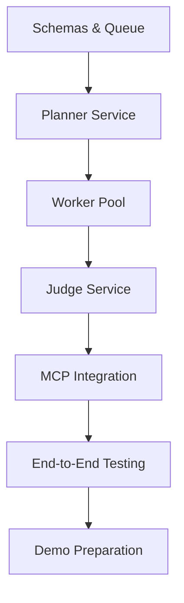

# Day 3 Plan: The Governor Phase
## Project Chimera - Infrastructure & Implementation

**Focus:** Building the "Safety Net" for the AI Swarm and delivering a fully functional autonomous influencer system.

**CRITICAL SUCCESS REQUIREMENT:** System must be operational and demonstrable by end of day for exam requirements.

---

## 🎯 Mission Critical: Functional System Delivery

### Core Architecture Implementation Priority
Based on the SRS and research, we need to implement the **FastRender Swarm** (Planner/Worker/Judge) with MCP integration as the minimum viable system.

---

## Feature Breakdown & Implementation Strategy

### 🏗️ Feature 1: Core Swarm Runtime (CRITICAL)
**Branch:** `feature/core-swarm-runtime`
**Duration:** 3 Hours
**Priority:** CRITICAL - System won't work without this

#### Deliverables:
- [ ] `src/swarm/planner.py` - Task decomposition and planning agent
- [ ] `src/swarm/worker.py` - Task execution agent pool
- [ ] `src/swarm/judge.py` - Quality control and validation agent
- [ ] `src/swarm/orchestrator.py` - Central coordination service
- [ ] Redis task queue orchestration
- [ ] PostgreSQL state management logic (simplified schema)

#### Acceptance Criteria:
- Planner can decompose goals into tasks
- Workers can execute tasks from Redis queue
- Judge can validate and approve/reject results
- Orchestrator coordinates the full swarm workflow
- End-to-end task flow works: Goal → Plan → Execute → Validate → Complete
- System can handle at least 5 concurrent tasks (reduced from 10)

#### Implementation Steps:
1. **Hour 1:** Planner + Orchestrator services with goal decomposition
2. **Hour 2:** Worker pool integration with Skills framework
3. **Hour 3:** Judge service with validation logic and end-to-end testing

---

### 🔌 Feature 2: MCP Integration Layer (CRITICAL)
**Branch:** `feature/mcp-integration`
**Duration:** 2 Hours
**Priority:** CRITICAL - Required for external connectivity

#### Deliverables:
- [ ] `src/mcp/client.py` - MCP client wrapper
- [ ] `mcp-server-mock/` - Mock MCP server for social media simulation
- [ ] Integration with Worker agents for tool calling
- [ ] Basic content posting capability (mock)

#### Acceptance Criteria:
- Workers can call MCP tools successfully
- System can connect to mock MCP server
- Mock social media posting works end-to-end
- **FALLBACK**: Direct API simulation if MCP fails

#### Implementation Steps:
1. **Hour 1:** MCP client setup and mock server creation
2. **Hour 2:** Worker-MCP integration and testing

---

### 🧠 Feature 3: Persona & Safety System (HIGH)
**Branch:** `feature/persona-safety`
**Duration:** 2 Hours
**Priority:** HIGH - Required for agent consistency and safety

#### Deliverables:
- [ ] `src/persona/soul.py` - SOUL.md parser and persona management
- [ ] `src/governance/confidence_scoring.py` - Confidence-based routing
- [ ] `personas/example_agent/SOUL.md` - Example persona definition
- [ ] Basic safety filters for content validation

#### Acceptance Criteria:
- Agents maintain consistent personality across interactions
- SOUL.md format properly parsed and applied
- Judge agents implement confidence scoring (>0.9 auto-approve, <0.7 reject)
- Basic safety filters prevent harmful content

#### Implementation Steps:
1. **Hour 1:** SOUL.md parser and persona loading
2. **Hour 2:** Confidence scoring and basic safety filters

---

### 🛡️ Feature 4: Testing & Validation (CRITICAL)
**Branch:** `feature/testing-validation`
**Duration:** 1 Hour
**Priority:** CRITICAL - Must prove system works

#### Deliverables:
- [ ] `tests/test_swarm_integration.py` - End-to-end swarm testing
- [ ] `tests/test_mcp_integration.py` - MCP connectivity testing
- [ ] Demo script showing full workflow
- [ ] Basic performance validation

#### Acceptance Criteria:
- Core integration tests pass
- Demo script runs successfully
- System can complete a basic campaign cycle
- Performance meets minimum requirements (5 tasks/minute)

---

### 📦 Feature 5: Demo Preparation (MEDIUM)
**Branch:** `feature/demo-preparation`
**Duration:** 2 Hours
**Priority:** MEDIUM - Required for presentation

#### Deliverables:
- [ ] `demo_script.py` - Automated demo workflow
- [ ] `README.md` - Updated setup instructions
- [ ] Basic web interface for goal input (optional)
- [ ] Presentation materials and architecture diagram

#### Acceptance Criteria:
- Demo runs without manual intervention
- Clear documentation for setup and usage
- Professional presentation of working system

---

## Implementation Timeline (8 Hours Total)

### Phase 1: Core Foundation (Hours 1-3)
**Branch:** `feature/core-swarm-runtime`
**CRITICAL PATH - Must complete for system to work**

#### Hour 1: Planner + Orchestrator Services
```python
# Priority implementations:
# - Goal parsing and task decomposition
# - Orchestrator coordination logic
# - Task queue publishing
```

#### Hour 2: Worker Pool
```python
# Priority implementations:
# - Task queue consumption
# - Skill execution framework integration
# - Result publishing to review queue
```

#### Hour 3: Judge Service + Integration
```python
# Priority implementations:
# - Result validation logic
# - Approve/reject/escalate decisions
# - End-to-end swarm workflow testing
```

### Phase 2: Connectivity & Intelligence (Hours 4-7)
**Parallel Implementation Tracks**

#### Hours 4-5: MCP Integration
**Branch:** `feature/mcp-integration`
```python
# Hour 4: MCP client and mock server
# Hour 5: Worker-MCP integration and testing
```

#### Hours 6-7: Persona & Safety
**Branch:** `feature/persona-safety`
```python
# Hour 6: SOUL.md parser and persona loading
# Hour 7: Confidence scoring and safety filters
```

### Phase 3: Validation & Demo (Hour 8)
**Branch:** `feature/testing-validation` + `feature/demo-preparation`
- Core integration testing
- Demo script preparation
- Final system validation

---

## Risk Mitigation & Contingency Plans

### High-Risk Areas:
1. **MCP Integration Complexity**
   - **Mitigation:** Start with simple mock servers, focus on basic connectivity
   - **Contingency:** Direct API simulation if MCP fails completely

2. **Swarm Coordination Issues**
   - **Mitigation:** Implement simple queue-based coordination first
   - **Contingency:** Fall back to sequential processing if parallel coordination fails

3. **Time Constraints**
   - **Mitigation:** Focus on core functionality, skip advanced features
   - **Contingency:** Prepare component demos if full integration fails

4. **Database Complexity**
   - **Mitigation:** Use simplified PostgreSQL schema, skip Weaviate for MVP
   - **Contingency:** File-based storage if database setup fails

### Critical Path Dependencies:


---

## Success Metrics & Acceptance Criteria

### Minimum Viable System (Must Have):
- [ ] **Goal Input:** System accepts high-level campaign goal
- [ ] **Task Decomposition:** Planner breaks goal into executable tasks
- [ ] **Task Execution:** Workers execute tasks using Skills framework
- [ ] **Quality Control:** Judge validates results with confidence scoring
- [ ] **Orchestration:** Orchestrator coordinates full workflow
- [ ] **External Interaction:** System can "post" to mock social media
- [ ] **End-to-End Demo:** Complete workflow from goal to execution

### Enhanced System (Should Have):
- [ ] **Persona Consistency:** Agents maintain character via SOUL.md
- [ ] **Safety Filters:** Basic content safety validation
- [ ] **MCP Integration:** Real MCP server connectivity (not just mock)
- [ ] **Performance:** System handles 5+ concurrent tasks

### Professional System (Nice to Have - Post-Demo):
- [ ] **HITL Interface:** Human review dashboard
- [ ] **Advanced Memory:** Weaviate semantic memory integration
- [ ] **Real Platforms:** Integration with actual social media APIs
- [ ] **Monitoring Dashboard:** Real-time system health monitoring

---

## Demo Script Requirements

### 5-Minute Demo Flow:
1. **Setup (30 seconds):** Show system architecture and components
2. **Goal Input (1 minute):** Input campaign goal via interface
3. **Planning (1 minute):** Show Planner decomposing goal into tasks
4. **Execution (2 minutes):** Watch Workers execute tasks in real-time
5. **Validation (30 seconds):** Show Judge approving/rejecting results
6. **Output (30 seconds):** Display final generated content

### Demo Success Criteria:
- [ ] System runs without manual intervention
- [ ] All components communicate successfully
- [ ] Generated content is coherent and on-brand
- [ ] Safety systems activate when appropriate
- [ ] Performance is acceptable for demo purposes

---

## Emergency Fallback Plan

### If Full System Fails (Last 2 Hours):
1. **Simplified Demo:** Single-agent system without swarm complexity
2. **Mock Everything:** Pre-generated content with simulated workflow
3. **Component Demo:** Show individual pieces working separately
4. **Architecture Presentation:** Focus on design and future implementation

### Minimum Passing Requirements:
- [ ] Working code that demonstrates core concepts
- [ ] Clear architecture documentation
- [ ] Evidence of MCP integration attempt
- [ ] Basic safety considerations implemented
- [ ] Professional presentation of work

---

## Day 3 Completion Checklist

### Code Deliverables:
```
├── src/
│   ├── swarm/
│   │   ├── planner.py
│   │   ├── worker.py
│   │   ├── judge.py
│   │   └── orchestrator.py
│   ├── mcp/
│   │   └── client.py
│   ├── persona/
│   │   └── soul.py
│   ├── governance/
│   │   └── confidence_scoring.py
│   └── models/
│       └── schemas.py
├── tests/
│   ├── test_swarm_integration.py
│   └── test_mcp_integration.py
├── personas/
│   └── example_agent/
│       └── SOUL.md
├── mcp-server-mock/
├── demo_script.py
└── README.md
```

### Documentation:
- [ ] Updated README with setup instructions
- [ ] API documentation for core components
- [ ] Demo script with clear instructions
- [ ] Architecture diagram (Mermaid)
- [ ] Troubleshooting guide

### Testing:
- [ ] All critical path tests pass
- [ ] Integration tests demonstrate end-to-end functionality
- [ ] Performance benchmarks meet minimum requirements
- [ ] Demo script runs successfully

### Presentation Materials:
- [ ] 5-minute Loom video walkthrough
- [ ] System architecture explanation
- [ ] Live demo of working system
- [ ] Evidence of spec-driven development
- [ ] MCP integration demonstration

---

## Final Hour Checklist (Hour 8)

### System Validation:
- [ ] Run full test suite
- [ ] Execute demo script successfully
- [ ] Verify all components communicate
- [ ] Test error handling and recovery
- [ ] Validate safety systems

### Documentation Finalization:
- [ ] Update README with final setup instructions
- [ ] Document any known issues or limitations
- [ ] Prepare troubleshooting guide
- [ ] Create architecture summary

### Demo Preparation:
- [ ] Practice demo script multiple times
- [ ] Prepare backup slides in case of technical issues
- [ ] Test recording setup for Loom video
- [ ] Prepare answers for potential questions

---

**CRITICAL SUCCESS FACTOR:** By end of Day 3, the system must demonstrate a complete workflow from goal input to content generation, proving the FastRender Swarm architecture works with MCP integration. This is non-negotiable for exam success.

**BACKUP PLAN:** If technical implementation fails, focus on demonstrating deep architectural understanding and clear implementation roadmap with working proof-of-concept components.