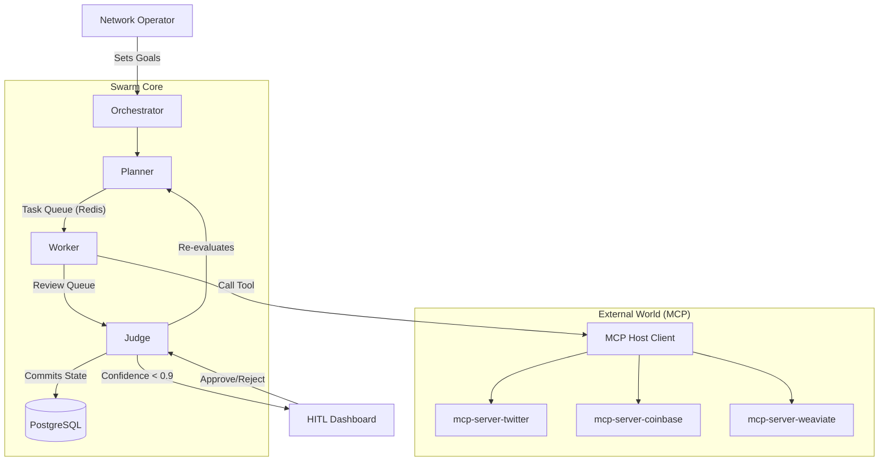

# Architecture Strategy: The FastRender Swarm

## 1. Core Methodology: GitHub Spec Kit
Project Chimera adheres to the **GitHub Spec Kit** framework for **Spec-Driven Development (SDD)**. 
- **Specs as Source of Truth:** Implementation never precedes ratified specifications.
- **Ambiguity Reduction:** Every functional and technical requirement is defined for machine-readability, ensuring that downstream AI agents can build features without hallucination.

## 2. Agent Pattern: Hierarchical Swarm (FastRender)
I reject monolithic agent designs in favor of a specialized, role-based **FastRender Swarm**. This pattern optimizes for parallel execution and rigorous quality control.

### Role Definitions:
- **Planner (The Strategist):** Responsible for decomposing high-level campaign goals (e.g., "Grow Ethiopian fashion presence") into a Directed Acyclic Graph (DAG) of atomic tasks.
- **Worker (The Executor):** Stateless, ephemeral agents that execute single tasks (e.g., "Draft a tweet," "Generate an image"). They utilize **MCP Tools** for all external interactions.
- **Judge (The Gatekeeper):** Validates Worker output against persona constraints, safety rules, and strategic goals. The Judge has the authority to Approve, Reject, or Escalate.

---

## 2. Human-in-the-Loop (HITL) & Governance
Safety is enforced through automated "Management by Exception."

- **Approval Gate:** Any action with a confidence score < 0.90 or containing sensitive topics (politics, finance) is automatically paused and routed to the **Orchestrator Dashboard** for human review.
- **Optimistic Concurrency Control (OCC):** Judges verify the `state_version` before committing results, preventing agents from acting on obsolete context (e.g., a campaign that was paused mid-execution).

---

## 4. Data Storage Strategy
I utilize a hybrid data layer to handle both relational state and semantic memory.

| Component | Choice | Justification |
| :--- | :--- | :--- |
| **Semantic Memory** | **Weaviate** (Vector DB) | RAG-based context for persona consistency across long timeframes. |
| **Transactional State**| **PostgreSQL** | **SQL Choice:** Required for ACID-compliant management of high-velocity video metadata, agent logs, and financial ledgers. |
| **Episodic Cache** | **Redis** | High-performance task queuing and short-term context. |
| **Financial Ledger** | **Base/On-chain** | Immutable record of all transactions via Coinbase AgentKit. |

> [!NOTE]
> **SQL vs NoSQL:** I prioritize SQL (PostgreSQL) for transactional integrity and structured metadata to ensure agents have a consistent, non-conflicting state of current campaigns.

---

## 5. Tools vs. Skills: The Separation of Concerns
To achieve "Orchestrator-grade" architecture, I maintain a strict distinction:
- **MCP Servers (Infrastructure):** External bridges that provide *connectivity* to the outside world (e.g., a Database connector, Twitter API wrapper).
- **Skills (Runtime Capabilities):** Internal, reusable logic packages that the agent invokes to perform *actions* (e.g., `skill_content_generator`, `skill_trend_fetcher`). Skills are defined by their I/O contracts in the `skills/` directory.

---

## 6. System Architecture Diagram

---
**Architectural Directives:**
- All inter-service communication MUST use Pydantic-validated JSON schemas.
- The `src/` directory shall house only the "Swarm Runtime" logic; all "Skills" are externalized as MCP Tools.
