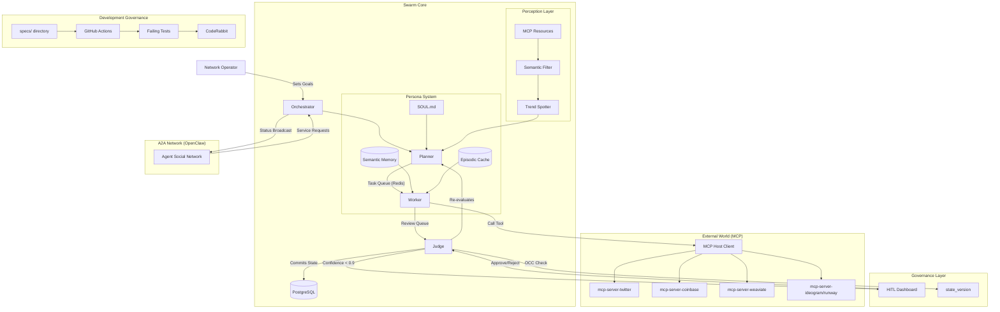

# Architecture Strategy: The FastRender Swarm

## 1. Core Methodology: GitHub Spec Kit
Project Chimera adheres to the **GitHub Spec Kit** framework for **Spec-Driven Development (SDD)**.
- **Specs as Source of Truth:** Implementation never precedes ratified specifications.
- **Ambiguity Reduction:** Every functional and technical requirement is defined for machine-readability, ensuring that downstream AI agents can build features without hallucination.

## 2. Agent Pattern: Hierarchical Swarm (FastRender)
I reject monolithic agent designs in favor of a specialized, role-based **FastRender Swarm**. This pattern optimizes for parallel execution and rigorous quality control.

### Role Definitions:
- **Planner (The Strategist):** Responsible for decomposing high-level campaign goals (e.g., "Grow Ethiopian fashion presence") into a Directed Acyclic Graph (DAG) of atomic tasks. Maintains the "Big Picture" state and implements dynamic re-planning based on context shifts.
- **Worker (The Executor):** Stateless, ephemeral agents that execute single tasks (e.g., "Draft a tweet," "Generate an image"). They utilize **MCP Tools** for all external interactions and operate in a "shared-nothing" architecture for maximum parallelism.
- **Judge (The Gatekeeper):** Validates Worker output against persona constraints, safety rules, and strategic goals. The Judge has the authority to Approve, Reject, or Escalate. Implements **Optimistic Concurrency Control (OCC)** with state_version validation to prevent race conditions.

---

## 3. Human-in-the-Loop (HITL) & Governance
Safety is enforced through automated "Management by Exception" with dynamic confidence scoring.

- **Confidence Scoring Framework:** Every Worker output includes a confidence_score (0.0-1.0) derived from LLM probability estimation.
- **Automated Escalation Logic:**
  - **High Confidence (>0.90):** Auto-Approve and execute immediately
  - **Medium Confidence (0.70-0.90):** Async Approval - pause for human review via Orchestrator Dashboard
  - **Low Confidence (<0.70):** Reject/Retry with refined prompts
- **Sensitive Topic Filters:** Politics, health advice, financial claims automatically route to HITL regardless of confidence score
- **Optimistic Concurrency Control (OCC):** Judges verify the `state_version` before committing results, preventing agents from acting on obsolete context (e.g., a campaign that was paused mid-execution).

---

## 4. Persona Management System
Each agent maintains persistent identity through the **SOUL.md** framework and hierarchical memory retrieval.

### Core Components:
- **SOUL.md Definition:** Immutable "DNA" containing backstory, voice/tone, core beliefs, and behavioral directives
- **Multi-Tiered Memory Architecture:**
  - **Short-Term (Episodic):** Redis cache for immediate conversation history (1-hour window)
  - **Long-Term (Semantic):** Weaviate vector database for semantic memory retrieval across months/years
  - **Context Construction:** Dynamic system prompt assembly injecting SOUL.md + retrieved memories
- **Dynamic Persona Evolution:** Judge agents trigger background processes to update mutable memories collection based on successful high-engagement interactions

---

## 5. Perception System (Data Ingestion)
Agents "perceive" the digital world exclusively through **MCP Resources** with intelligent filtering.

### Architecture:
- **Active Resource Monitoring:** Continuous polling of configured MCP Resources (twitter://mentions, news://ethiopia/fashion, market://crypto/eth)
- **Semantic Filtering:** Lightweight LLM (Gemini 3 Flash) scores content relevance against active goals
- **Relevance Threshold:** Only content exceeding configurable threshold (e.g., 0.75) triggers Task creation
- **Trend Detection:** Background "Trend Spotter" Workers analyze aggregated data over time intervals to generate "Trend Alerts"

---

## 6. Creative Engine (Content Generation)
Multimodal content production with character consistency and quality validation.

### Generation Pipeline:
- **Multimodal Tools:** Text (native LLM), Images (mcp-server-ideogram), Video (mcp-server-runway/luma)
- **Character Consistency Lock:** All image generation includes character_reference_id or style LoRA for visual coherence
- **Tiered Video Strategy:**
  - **Tier 1 (Daily):** Living Portraits via Image-to-Video (cost-effective)
  - **Tier 2 (Hero):** Full Text-to-Video for major campaigns
- **Dual-Model Validation:** Judge uses Vision-capable model to verify generated content matches persona before publication

---

## 7. Data Storage Strategy
I utilize a hybrid data layer to handle both relational state and semantic memory.

| Component | Choice | Justification |
| :--- | :--- | :--- |
| **Semantic Memory** | **Weaviate** (Vector DB) | RAG-based context for persona consistency across long timeframes. Self-hosted option prevents vendor lock-in. |
| **Transactional State**| **PostgreSQL** | **SQL Choice:** Required for ACID-compliant management of high-velocity video metadata, agent logs, and financial ledgers. |
| **Episodic Cache** | **Redis** | High-performance task queuing (TaskQueue/ReviewQueue) and short-term context (1-hour window). |
| **Financial Ledger** | **Base/On-chain** | Immutable record of all transactions via Coinbase AgentKit. |

> [!NOTE]
> **SQL vs NoSQL:** I prioritize SQL (PostgreSQL) for transactional integrity and structured metadata to ensure agents have a consistent, non-conflicting state of current campaigns.

---

## 8. Agent-to-Agent (A2A) Protocols
For OpenClaw ecosystem integration, Chimera agents implement standardized social protocols.

### Required A2A Capabilities:
- **Capability Advertisement:** Machine-readable schemas broadcasting agent services (e.g., "Gen-Z trend analysis provider")
- **Trust & Reputation Signaling:** Cryptographic identity proof and interaction track record to prevent Sybil attacks
- **Status Heartbeating:** Real-time availability broadcasting (Planning/Working/Judging/Sleeping states)
- **Economic Negotiation (ACP):** Autonomous service price negotiation using Agent Commerce Protocol (e.g., "0.05 USDC for 5-second video render")

---

## 9. Tools vs. Skills: The Separation of Concerns
To achieve "Orchestrator-grade" architecture, I maintain a strict distinction:
- **MCP Servers (Infrastructure):** External bridges that provide *connectivity* to the outside world (e.g., a Database connector, Twitter API wrapper).
- **Skills (Runtime Capabilities):** Internal, reusable logic packages that the agent invokes to perform *actions* (e.g., `skill_content_generator`, `skill_trend_fetcher`). Skills are defined by their I/O contracts in the `skills/` directory.

### Skills Interface Contracts:
Each skill must define:
- **Input Schema:** Pydantic models for parameters
- **Output Schema:** Standardized response format
- **Error Handling:** Graceful failure modes
- **Test Contracts:** Failing tests that define expected behavior

---

## 10. Failover & Disaster Recovery (DR)
Safety and continuity are ensured through a robust recovery architecture.
- **Multi-Region Availability:** Stateless Worker agents deployed across multiple cloud regions (e.g., AWS us-east-1 and eu-west-1).
- **Database Replication:** PostgreSQL utilize cross-region Read Replicas for immediate failover. Weaviate clusters use multi-node replication factors.
- **State Recovery:** Task Queue (Redis) persistence enabled with RDB/AOF. In case of swarm-level failure, Planners reconstruct the DAG state from PostgreSQL logs.
- **RTO/RPO:** Target Recovery Time Objective (RTO) < 5 mins; Recovery Point Objective (RPO) < 1 min for transactional data.

---

## 11. Operational Runbooks
Standardized procedures for routine maintenance and minor incident response.
- **RB-001: Agent Stall Recovery:** Procedure to identify and restart "zombie" Worker agents using the Orchestrator health check tool.
- **RB-002: Cache Invalidation:** Standard commands to flush specific Redis keys when persona context becomes corrupted or outdated.
- **RB-003: Database Migration:** Blue-Green deployment strategy for PostgreSQL schema updates to ensure zero-downtime for active campaigns.
- **RB-004: Tooling Reset:** Hard-reset protocol for MCP servers when bridge connectivity fails.

---

## 12. Ops Playbooks (Emergency Response)
High-level strategic response plans for critical security or infrastructure events.
- **PB-001: MoltBook-Style Breach:** Immediate non-custodial wallet freeze, secret rotation (Vault/AWS Secrets Manager), and automated audit log export.
- **PB-002: LLM Provider Outage:** Dynamic switching to secondary LLM provider (e.g., Anthropic to Gemini) via the Orchestrator's provider-agnostic abstraction layer.
- **PB-003: Malicious Input/Injection:** Automated quarantine of the affected agent sub-swarm and mandatory HITL review for all pending outputs from that persona.

---

## 13. System Architecture Diagram

---
**Architectural Directives:**
- All inter-service communication MUST use Pydantic-validated JSON schemas.
- The `src/` directory shall house only the "Swarm Runtime" logic; all "Skills" are externalized with defined I/O contracts.
- Every agent action MUST pass through the MCP layer for standardization and governance.
- Failing tests define the "contract" that AI agents must fulfill during implementation.
- Spec alignment is validated automatically in CI/CD pipeline before deployment.
- Agent-to-Agent communication follows OpenClaw protocols for ecosystem interoperability.
