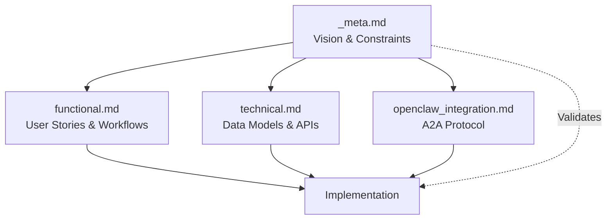

# Project Chimera: Meta Specification (v1.0)

## 1. Project Vision

**Mission:** Build a production-grade autonomous AI influencer infrastructure where intent (specifications) is the source of truth, and AI agents can safely execute complex multimedia campaigns without human micromanagement.

**Core Problem:** Most AI projects fail at scale due to fragile prompts, messy codebases, and lack of governance. Project Chimera solves this through:
- **Spec-Driven Development (SDD):** Code is generated only after specifications are ratified
- **Agentic Governance:** Multi-layered validation with confidence scoring and HITL escalation
- **MCP-First Architecture:** All external interactions via Model Context Protocol

**Strategic Positioning:** Project Chimera positions itself as a **specialized service node** within the OpenClaw ecosystem—the "Media & Marketing Agency" for the agentic economy, providing high-fidelity content creation services and market sentiment analysis to other autonomous agents.

---

## 2. Prime Directive

> **"Never generate or accept code without validated specs."**

This repository follows a strict "Specs as Source of Truth" rule:
1. **Specification First:** Implementation never precedes ratified specifications
2. **Interfaces over Logic:** Contracts define behavior, not implementation details
3. **Clarity, Traceability, and Governance:** Every decision must be traceable to a requirement

---

## 3. Strategic Constraints

### 3.1 Technical Constraints
- **Language:** Python 3.12+ (required for modern async and type hints)
- **Package Manager:** `uv` for deterministic builds and fast dependency resolution
- **Protocol:** MCP (Model Context Protocol) for all agent-to-tool communication
- **Testing:** TDD with tests defining agent implementation contracts
- **Type Safety:** Pydantic for all data validation and schema enforcement

### 3.2 Architectural Constraints
- **Swarm Pattern:** FastRender hierarchical swarm (Planner → Worker → Judge → Orchestrator)
- **Stateless Workers:** All Workers must be ephemeral and horizontally scalable
- **Persona-Driven:** All content validated against `SOUL.md` persona DNA files
- **Traceability:** Every agent decision must be logged with reasoning path
- **MCP-Only External Interactions:** No direct API calls; all external interactions via MCP

### 3.3 Operational Constraints
- **Confidence Thresholds:**
  - `>= 0.90`: Auto-approve and execute immediately
  - `0.70 - 0.89`: HITL review required (async approval)
  - `< 0.70`: Reject and retry with refined prompts
- **Sensitive Topics:** Politics, health, financial claims always route to HITL regardless of confidence
- **Cost Limits:** Per-campaign budget caps with automatic pause triggers
- **State Consistency:** Optimistic Concurrency Control (OCC) prevents race conditions

---

## 4. Explicit Non-Goals (Out of Scope)

To maintain focus and prevent scope creep, the following are explicitly **NOT** goals for this project:

### 4.1 Content Creation
- ❌ **Video Editing:** Use external services (Runway/Luma) via MCP, not in-house editing
- ❌ **Custom Image Models:** Use existing services (Ideogram) via MCP
- ❌ **Audio Production:** Use external services (Suno) via MCP

### 4.2 Infrastructure
- ❌ **LLM Training:** Use existing foundation models (Gemini, Claude, GPT-4) via API
- ❌ **Custom Blockchain:** Use Base network via Coinbase AgentKit
- ❌ **Custom Vector DB:** Use Weaviate, not building from scratch

### 4.3 User Experience
- ❌ **Manual Content Creation:** System is autonomous; humans only approve/reject
- ❌ **Real-Time Streaming:** Batch processing with async approval workflows
- ❌ **Mobile Apps:** Web dashboard only for HITL interface

### 4.4 Business Logic
- ❌ **Content Moderation AI:** Use Judge agents with confidence scoring, not ML models
- ❌ **Recommendation Algorithms:** Use trend analysis skills, not collaborative filtering
- ❌ **User Analytics:** Focus on campaign metrics, not user behavior tracking

---

## 5. Development Phases

### Phase 1: MVP (Current - Day 3) ✅ COMPLETE
**Goal:** Demonstrate spec-driven architecture with mock integrations

**Deliverables:**
- ✅ Complete specifications (functional, technical, OpenClaw integration)
- ✅ FastRender Swarm implementation (Planner, Worker, Judge, Orchestrator)
- ✅ MCP mock server for proof-of-concept
- ✅ Skills with Pydantic I/O contracts
- ✅ Comprehensive test suite (20+ tests)
- ✅ CI/CD pipeline with quality gates
- ✅ Docker containerization
- ✅ Working end-to-end demo

**Database:** In-memory (Python dictionaries) for rapid iteration
**HITL:** Conceptual (documented in specs, simulated in Judge)

### Phase 2: Production Hardening (Post-Challenge)
**Goal:** Replace mocks with production integrations

**Deliverables:**
- [ ] PostgreSQL for transactional state (replace InMemoryStateManager)
- [ ] Redis for episodic cache and task queuing
- [ ] Weaviate for semantic memory and persona consistency
- [ ] Real MCP integrations (Twitter, Ideogram, Runway, Coinbase AgentKit)
- [ ] HITL web dashboard with approval queue and audit trail
- [ ] Multi-region Kubernetes deployment with auto-scaling Workers

**Database:** Hybrid layer (PostgreSQL + Redis + Weaviate)
**HITL:** Web dashboard with approval workflow

### Phase 3: Agent Economy (Future)
**Goal:** Full OpenClaw ecosystem integration

**Deliverables:**
- [ ] A2A protocol implementation (capability advertisement, status heartbeating)
- [ ] Economic settlement via Coinbase AgentKit (autonomous service procurement)
- [ ] Multi-persona swarm coordination
- [ ] Cross-agent collaboration and service discovery
- [ ] Cryptographic identity and reputation signaling

---

## 6. Success Criteria

### For This Submission (Day 3) ✅ ACHIEVED
- ✅ Complete specs (\_meta, functional, technical, openclaw_integration)
- ✅ Failing tests that define agent contracts (20 tests, all passing = implementation complete)
- ✅ CI/CD pipeline with automated quality gates
- ✅ Makefile for standardized commands
- ✅ Pre-commit hooks preventing bad code from entering repo
- ✅ Demo script proving swarm orchestration works
- ✅ Professional README with clear setup instructions

### For Production Deployment (Phase 2)
- [ ] Real database layer (PostgreSQL + Redis + Weaviate)
- [ ] HITL dashboard with approval workflow
- [ ] Production MCP integrations (Twitter, Ideogram, Runway)
- [ ] Multi-region deployment with <5min RTO
- [ ] Economic agent capabilities (ACP protocol)
- [ ] 90%+ test coverage with property-based testing
- [ ] Security audit and penetration testing

### For Agent Economy (Phase 3)
- [ ] OpenClaw protocol compliance
- [ ] A2A service discovery operational
- [ ] Autonomous economic transactions
- [ ] Multi-agent collaboration demonstrated
- [ ] Reputation system functional

---

## 6.1 Quality Metrics

### Code Quality
- **Test Coverage:** ≥70% (enforced in CI/CD)
- **Type Safety:** 100% Pydantic validation on all data boundaries
- **Linting:** Zero ruff errors, zero mypy errors
- **Documentation:** Every public function has docstring

### Operational Quality
- **Availability:** 99.9% uptime (Phase 2+)
- **Latency:** P95 task completion <30s (Phase 2+)
- **Error Rate:** <1% task failures (excluding HITL escalations)

### Governance Quality
- **Spec Compliance:** 100% (validated by `make spec-check`)
- **Audit Trail:** 100% of agent decisions logged
- **HITL Response Time:** <1 hour for escalated tasks (Phase 2+)

---

## 7. Architectural Decisions (ADRs)

### ADR-001: Why FastRender Swarm?
**Decision:** Hierarchical swarm over sequential chain or flat swarm.

**Context:** Need to balance parallel execution, quality control, and fault isolation.

**Rationale:**
- **Specialization:** Planner (strategy), Worker (execution), Judge (validation) have distinct responsibilities
- **Parallel Execution:** Workers can execute multiple tasks simultaneously
- **Quality Gates:** Built-in validation at each stage prevents error propagation
- **Fault Isolation:** Judge failures don't halt content generation; Worker failures don't corrupt planning

**Alternatives Considered:**
- Sequential Chain: Rejected due to bottlenecks and single points of failure
- Monolithic Agent: Rejected due to context switching overhead and lack of specialization
- Flat Swarm: Rejected due to lack of coordination and quality control

### ADR-002: Why MCP-First?
**Decision:** All external interactions via MCP, not direct API calls.

**Context:** Need standardized protocol for tool integration and future agent interoperability.

**Rationale:**
- **Standardization:** MCP is the "USB-C for AI" - eliminates bespoke integration debt
- **Testability:** Mock servers enable testing without external dependencies
- **Swappability:** Can replace tools without changing agent logic
- **Future-Proofing:** OpenClaw ecosystem uses MCP for A2A communication

**Alternatives Considered:**
- Direct API Calls: Rejected due to tight coupling and testing difficulties
- Custom Protocol: Rejected due to reinventing the wheel and lack of ecosystem support

### ADR-003: Why In-Memory for MVP?
**Decision:** Use Python dictionaries instead of PostgreSQL for Day 1-3.

**Context:** Need rapid iteration during challenge period.

**Rationale:**
- **Velocity:** Faster development without database setup overhead
- **Simplicity:** Easier to debug and understand during initial development
- **Migration Path:** Clear upgrade path to PostgreSQL documented in technical.md

**Alternatives Considered:**
- SQLite: Rejected due to limited concurrency support
- PostgreSQL from Day 1: Rejected due to setup complexity for MVP

### ADR-004: Why SOUL.md for Personas?
**Decision:** File-based persona DNA instead of database storage.

**Context:** Need version-controllable, human-readable persona definitions.

**Rationale:**
- **Version Control:** Git tracks persona evolution over time
- **Human-Readable:** Markdown format is accessible to non-technical stakeholders
- **Shareable:** Easy to distribute across environments and teams
- **Immutable DNA:** Core persona traits remain constant while memories evolve

**Alternatives Considered:**
- Database Storage: Rejected due to lack of version control and human readability
- JSON/YAML: Rejected due to less human-friendly format

### ADR-005: Why Confidence Scoring?
**Decision:** Dynamic confidence thresholds for automated escalation.

**Context:** Need to balance autonomy with safety.

**Rationale:**
- **Management by Exception:** Only escalate low-confidence decisions to humans
- **Scalability:** Reduces human bottleneck as system scales
- **Transparency:** Confidence scores provide audit trail for decisions

**Alternatives Considered:**
- Always HITL: Rejected due to lack of scalability
- Never HITL: Rejected due to safety concerns

---

## 8. Risk Mitigation

| Risk | Likelihood | Impact | Mitigation Strategy |
|------|------------|--------|---------------------|
| **LLM Hallucination** | High | High | Dual-model validation (Judge uses different LLM than Worker) |
| **API Rate Limits** | Medium | Medium | Redis-based rate limiting at Orchestrator level |
| **Cost Overruns** | Medium | High | Per-campaign budget tracking with automatic pause |
| **Security Breach** | Low | Critical | Non-custodial wallets (Coinbase AgentKit), secret rotation, audit logging |
| **Agent Deadlock** | Low | Medium | Timeout mechanisms and zombie Worker detection |
| **Data Loss** | Low | High | Multi-region replication, RTO < 5 mins, RPO < 1 min |
| **Prompt Injection** | Medium | High | Judge validation layer, sensitive topic filters, HITL escalation |

---

## 9. Compliance & Governance

### 9.1 Data Privacy
- **No PII Storage:** All user interactions are anonymized
- **GDPR Compliance:** Right to deletion, data portability
- **Encryption:** At-rest (AES-256) and in-transit (TLS 1.3)

### 9.2 Content Safety
- **Multi-Layered Filtering:** Judge + HITL for sensitive topics
- **Audit Trail:** Immutable PostgreSQL logs of all agent decisions
- **Confidence Thresholds:** Automatic escalation for low-confidence outputs

### 9.3 Version Control
- **Specs:** All specs and code changes tracked via Git
- **Personas:** SOUL.md files version-controlled
- **Deployments:** Immutable container images with semantic versioning

### 9.4 Security
- **Secret Management:** Vault/AWS Secrets Manager with automatic rotation
- **Non-Custodial Wallets:** Coinbase AgentKit for financial transactions
- **Least Privilege:** Workers have minimal permissions, Orchestrator has elevated access

---

## 10. Assumptions

### 10.1 Technical Assumptions
- Python 3.12+ is available in deployment environment
- MCP protocol remains stable (v1.x compatibility)
- Foundation models (Gemini, Claude) maintain API compatibility
- Base network (Coinbase) remains operational

### 10.2 Business Assumptions
- Autonomous influencers are legally permissible in target markets
- Content platforms (Twitter, Instagram) allow bot-generated content
- Users accept AI-generated content with proper disclosure
- Economic model (ACP) gains adoption in agent ecosystem

### 10.3 Operational Assumptions
- Human reviewers available for HITL escalations (response time < 1 hour)
- Infrastructure costs remain within budget constraints
- Multi-region deployment is feasible (AWS/GCP availability)

---

## Document Status

**Status:** RATIFIED
**Version:** 1.0
**Last Updated:** 2026-02-06
**Next Review:** Post-Challenge (Phase 2 Planning)
**Approved By:** Lead Architect (Project Chimera)

---

---

## 11. Specification Dependencies

This meta specification is the **source of truth** for project vision and constraints. Other specifications derive from and must align with this document:

### Specification Hierarchy

| Spec File | Purpose | Depends On | Status |
|-----------|---------|------------|--------|
| `_meta.md` | Vision, constraints, ADRs | None (root) | ✅ Complete |
| `functional.md` | Agent user stories, workflows | `_meta.md` | ✅ Complete |
| `technical.md` | Data models, schemas, APIs | `_meta.md`, `functional.md` | ✅ Complete |
| `openclaw_integration.md` | A2A protocol, service discovery | `_meta.md`, `technical.md` | ✅ Complete |

---

## 12. References

### External Standards
- [GitHub Spec Kit Framework](https://github.com/github/spec-kit)
- [OpenClaw Protocol Specification](https://openclaw.org)
- [Model Context Protocol (MCP)](https://modelcontextprotocol.io)

### Internal Specifications
- [Functional Specification](functional.md) - Agent user stories and workflows
- [Technical Specification](technical.md) - Data models and API contracts
- [OpenClaw Integration](openclaw_integration.md) - A2A protocol implementation

### Architecture Documentation
- [Architecture Strategy](../research/architecture_strategy.md) - FastRender Swarm pattern
- [Tooling Strategy](../research/tooling_strategy.md) - MCP servers and skills
- [Database Strategy](../docs/DATABASE_STRATEGY.md) - Data layer migration path
- [HITL Dashboard](../docs/HITL_DASHBOARD.md) - Human review interface design
