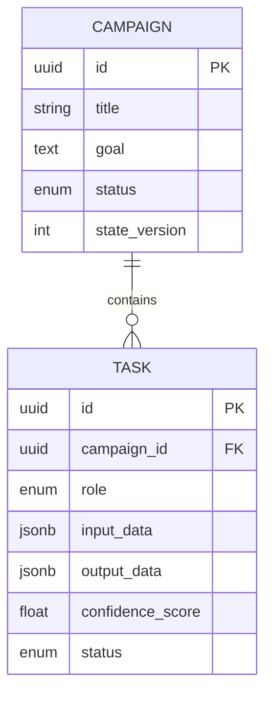

# Project Chimera: Technical Specifications (v1.0)

## 1. Data Schema (PostgreSQL)

### 1.1 Table: `campaigns`
- `id`: UUID (PK)
- `title`: VARCHAR(255)
- `goal`: TEXT
- `status`: ENUM ('PLANNING', 'ACTIVE', 'PAUSED', 'COMPLETED')
- `state_version`: INTEGER (OCC)

### 1.2 Table: `tasks`
- `id`: UUID (PK)
- `campaign_id`: UUID (FK)
- `role`: ENUM ('PLANNER', 'WORKER', 'JUDGE')
- `input_data`: JSONB
- `output_data`: JSONB
- `confidence_score`: FLOAT
- `status`: ENUM ('PENDING', 'PROCESSING', 'COMPLETED', 'FAILED', 'ESC_HITL')

### 1.3 Database ERD (Entity Relationship Diagram)



## 2. Pydantic Models

### 2.1 Worker Interface
```python
class WorkerTaskInput(BaseModel):
    task_id: UUID
    skill_name: str
    params: Dict[str, Any]
    persona_id: str

class WorkerTaskOutput(BaseModel):
    task_id: UUID
    result: Any
    confidence_score: float
    reasoning: str
```

## 3. Hybrid Data Layer
- **PostgreSQL:** ACID transactional state.
- **Weaviate:** Semantic memory (Vector DB).
  - **Class: `PersonaMemory`**
    - `persona_id`: text (Keyword)
    - `content`: text (Vectorized)
    - `category`: text (Episodic, Semantic, SOUL)
    - `timestamp`: date
- **Redis:** Episodic context (Task/Review Queues).

## 4. MCP Communication
- All external interactions via standardized MCP tool calls.
- Standardized error handling and retry logic.
